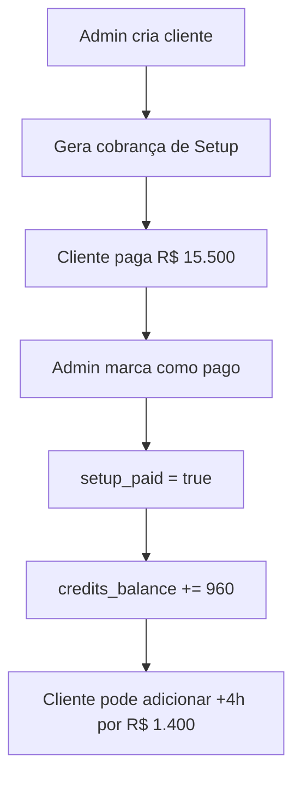
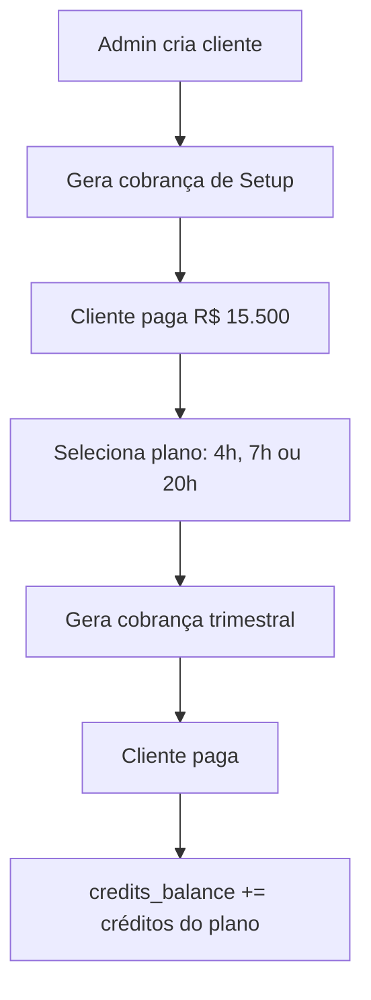
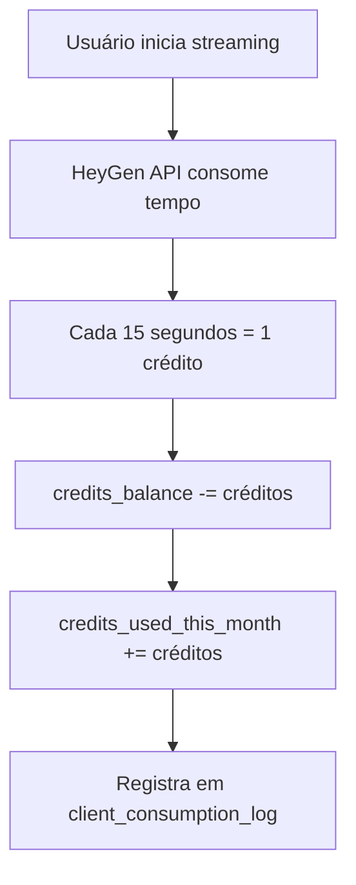

# 📚 Documentação: Página AdminClientDetails

## Visão Geral

A página `AdminClientDetails` é o **painel de controle administrativo** para gerenciar um cliente específico da plataforma Euvatar. Ela permite visualizar, editar e gerenciar todos os aspectos de um cliente, incluindo dados básicos, integrações, pagamentos e avatares.

**Arquivo:** `src/pages/AdminClientDetails.tsx`  
**Rota:** `/admin/client/:clientId`

---

## 🗄️ Conexões com o Supabase

Esta página interage com **6 tabelas** do banco de dados:

| Tabela | Função |
|--------|--------|
| `admin_clients` | Dados principais do cliente |
| `client_avatars` | Avatares do cliente |
| `client_payments` | Histórico de pagamentos |
| `client_event_additions` | Adições de horas extras (modalidade evento) |
| `client_url_history` | Log de mudanças de URL |
| `client_consumption_log` | Histórico de consumo de créditos |

---

## 📋 Campos da Tabela `admin_clients`

### Identificação e Acesso

| Campo | Tipo | Descrição | Por que existe? |
|-------|------|-----------|-----------------|
| `id` | UUID | Identificador único do cliente | Chave primária para identificar o cliente em todas as tabelas |
| `name` | TEXT | Nome do cliente/empresa | Exibição e identificação visual |
| `email` | TEXT | E-mail do cliente | Contato e login no portal do cliente |
| `password_hash` | TEXT | Senha do cliente (texto simples*) | Acesso ao portal do cliente. *Nota: deveria ser hash! |
| `client_url` | TEXT | Slug único da URL | Acesso personalizado: `euvatar.com/{client_url}` |

### Status e Controle

| Campo | Tipo | Valores | Por que existe? |
|-------|------|---------|-----------------|
| `status` | TEXT | `ativo`, `pausado`, `cancelado` | Controla se o cliente pode usar a plataforma |

**Estados:**
- **ativo**: Cliente pode usar normalmente a integração HeyGen
- **pausado**: Acesso temporariamente suspenso (ex: inadimplência)
- **cancelado**: Conta encerrada permanentemente

### Modalidade de Contratação

| Campo | Tipo | Valores | Por que existe? |
|-------|------|---------|-----------------|
| `modality` | ENUM | `evento`, `plano_trimestral` | Define o tipo de contrato do cliente |
| `current_plan` | ENUM | `plano_4h`, `plano_7h`, `plano_20h` | Plano específico (só para `plano_trimestral`) |

**Modalidades explicadas:**

1. **Evento**: Cliente paga por blocos de 4 horas
   - Setup inicial: R$ 15.500 (inclui 4h)
   - Cada bloco adicional: R$ 1.400 (4h)
   - Máximo: 10 blocos = 40 horas

2. **Plano Trimestral**: Cliente paga mensalidade fixa
   - Plano 4h/mês: R$ 1.400/mês
   - Plano 7h/mês: R$ 2.100/mês  
   - Plano 20h/mês: R$ 5.000/mês

### Créditos e Consumo

| Campo | Tipo | Descrição | Por que existe? |
|-------|------|-----------|-----------------|
| `credits_balance` | NUMERIC | Créditos disponíveis | Saldo atual que o cliente pode usar |
| `credits_used_this_month` | NUMERIC | Créditos usados no mês | Acompanhamento do consumo mensal |

**Sistema de Créditos:**
```
1 crédito Euvatar = 15 segundos de uso
20 créditos = 5 minutos = 1 crédito HeyGen
240 créditos = 1 hora de uso
```

### Pagamento do Setup

| Campo | Tipo | Descrição | Por que existe? |
|-------|------|-----------|-----------------|
| `setup_paid` | BOOLEAN | Setup foi pago? | Libera acesso inicial à plataforma |
| `setup_paid_at` | TIMESTAMP | Data do pagamento | Registro histórico |
| `setup_stripe_link` | TEXT | Link de pagamento Stripe | Para enviar ao cliente |

**Fluxo do Setup:**
1. Admin gera cobrança de setup → cria registro em `client_payments`
2. Link é enviado ao cliente
3. Cliente paga → admin marca como "pago"
4. `setup_paid` = true, créditos são adicionados

### Controle do Plano

| Campo | Tipo | Descrição | Por que existe? |
|-------|------|-----------|-----------------|
| `plan_start_date` | DATE | Início do contrato | Calcular renovações e vencimentos |
| `plan_expiration_date` | DATE | Fim do contrato | Alertar sobre renovação |
| `last_credit_reload_at` | TIMESTAMP | Última recarga | Controle de ciclo de recarga |

### Histórico de Pagamentos

| Campo | Tipo | Descrição | Por que existe? |
|-------|------|-----------|-----------------|
| `last_payment_status` | TEXT | Status do último pagamento | Visão rápida da situação financeira |
| `last_payment_at` | TIMESTAMP | Data do último pagamento | Acompanhamento de adimplência |

### Integração HeyGen

| Campo | Tipo | Descrição | Por que existe? |
|-------|------|-----------|-----------------|
| `heygen_api_key` | TEXT | Chave de API do HeyGen | Autenticação na API do HeyGen |
| `heygen_avatar_id` | TEXT | ID do avatar padrão | Avatar usado nas transmissões |
| `heygen_interactive_avatar_id` | TEXT | ID do avatar interativo | Avatar para streaming interativo |
| `heygen_api_key_valid` | BOOLEAN | API key está funcionando? | Alerta se precisar corrigir |

**Por que 3 campos HeyGen?**
- `heygen_api_key`: Credencial de acesso à conta HeyGen do cliente
- `heygen_avatar_id`: Avatar criado pelo cliente para vídeos gravados
- `heygen_interactive_avatar_id`: Avatar específico para streaming em tempo real

### Timestamps

| Campo | Tipo | Descrição |
|-------|------|-----------|
| `created_at` | TIMESTAMP | Quando o cliente foi criado |
| `updated_at` | TIMESTAMP | Última modificação |

---

## 📋 Tabela `client_avatars`

Armazena os avatares que pertencem ao cliente.

| Campo | Tipo | Descrição | Por que existe? |
|-------|------|-----------|-----------------|
| `id` | UUID | ID único do avatar | Identificação |
| `client_id` | UUID | FK para `admin_clients` | Relaciona avatar ao cliente |
| `name` | TEXT | Nome do avatar | Identificação visual |
| `avatar_url` | TEXT | URL da imagem | Preview do avatar |
| `heygen_avatar_id` | TEXT | ID no HeyGen | Referência na API HeyGen |
| `credits_used` | NUMERIC | Créditos consumidos | Controle de uso por avatar |
| `created_at` | TIMESTAMP | Data de criação | Histórico |

---

## 📋 Tabela `client_payments`

Histórico de todas as cobranças e pagamentos.

| Campo | Tipo | Descrição | Por que existe? |
|-------|------|-----------|-----------------|
| `id` | UUID | ID único | Identificação |
| `client_id` | UUID | FK para `admin_clients` | Relaciona ao cliente |
| `payment_type` | TEXT | `setup`, `plano_trimestral`, `adicional` | Tipo de cobrança |
| `amount_cents` | INTEGER | Valor em centavos | Ex: 1550000 = R$ 15.500 |
| `description` | TEXT | Descrição da cobrança | Clareza para o cliente |
| `stripe_link` | TEXT | Link do Stripe | Para o cliente pagar |
| `stripe_payment_id` | TEXT | ID do pagamento no Stripe | Reconciliação |
| `status` | TEXT | `pendente`, `pago`, `cancelado` | Estado do pagamento |
| `credits_to_add` | NUMERIC | Créditos a adicionar | Quando pago, adiciona ao saldo |
| `paid_at` | TIMESTAMP | Data do pagamento | Registro |
| `created_at` | TIMESTAMP | Data da cobrança | Histórico |

---

## 📋 Tabela `client_event_additions`

Específica para modalidade EVENTO - controla blocos de horas adicionais.

| Campo | Tipo | Descrição | Por que existe? |
|-------|------|-----------|-----------------|
| `id` | UUID | ID único | Identificação |
| `client_id` | UUID | FK para `admin_clients` | Relaciona ao cliente |
| `hours` | INTEGER | Horas do bloco (sempre 4) | Quantidade de horas |
| `credits` | NUMERIC | Créditos do bloco (sempre 960) | Créditos correspondentes |
| `amount_cents` | INTEGER | Valor (sempre 140000) | R$ 1.400 por bloco |
| `stripe_link` | TEXT | Link de pagamento | Para enviar ao cliente |
| `status` | TEXT | `pendente`, `pago` | Estado |
| `paid_at` | TIMESTAMP | Data do pagamento | Registro |
| `created_at` | TIMESTAMP | Data da criação | Histórico |

---

## 📋 Tabela `client_url_history`

Log de alterações na URL do cliente (auditoria).

| Campo | Tipo | Descrição | Por que existe? |
|-------|------|-----------|-----------------|
| `id` | UUID | ID único | Identificação |
| `client_id` | UUID | FK para `admin_clients` | Relaciona ao cliente |
| `old_url` | TEXT | URL anterior | Histórico |
| `new_url` | TEXT | Nova URL | O que foi alterado |
| `changed_by` | TEXT | Quem alterou | Auditoria |
| `created_at` | TIMESTAMP | Data da mudança | Quando |

---

## 🔄 Fluxos de Negócio

### Fluxo 1: Novo Cliente (Evento)



### Fluxo 2: Novo Cliente (Plano)



### Fluxo 3: Consumo de Créditos



---

## 🎛️ Constantes do Sistema

```typescript
// Preços em centavos (dividir por 100 para reais)
const SETUP_PRICE = 1550000;        // R$ 15.500,00
const EVENT_HOUR_PRICE = 35000;     // R$ 350,00 por hora
const EVENT_BLOCK_HOURS = 4;        // Cada bloco = 4 horas
const CREDITS_PER_HOUR = 240;       // 240 créditos = 1 hora

// Conversões
// 1 crédito Euvatar = 15 segundos
// 20 créditos Euvatar = 5 minutos = 1 crédito HeyGen

// Planos
const planConfigs = {
  plano_4h:  { hours: 4,  pricePerHour: 35000, credits: 960 },
  plano_7h:  { hours: 7,  pricePerHour: 30000, credits: 1680 },
  plano_20h: { hours: 20, pricePerHour: 25000, credits: 4800 },
};
```

---

## 🔐 Segurança e RLS

A tabela `admin_clients` possui RLS com política:

```sql
Policy: "Admin can manage clients"
Command: ALL
Using Expression: true
```

Isso significa que **qualquer usuário autenticado** pode acessar todos os clientes. 

⚠️ **Atenção**: Esta política é muito permissiva! Em produção, deveria verificar se o usuário é admin.

---

## 📝 Funções de Utilidade

```typescript
// Converte créditos para horas
creditsToHours(credits: number): string
// Ex: creditsToHours(960) → "4.00"

// Converte créditos para minutos
creditsToMinutes(credits: number): string
// Ex: creditsToMinutes(20) → "5.0"

// Converte segundos para créditos
secondsToCredits(seconds: number): number
// Ex: secondsToCredits(300) → 20

// Formata valores monetários
formatCurrency(cents: number): string
// Ex: formatCurrency(1550000) → "R$ 15.500,00"
```

---

## 🧩 Componentes da Interface

### Cards de Resumo (Topo)
1. **Créditos**: Saldo atual e equivalente em horas
2. **Consumo do Mês**: Créditos usados no período
3. **Avatares**: Quantidade de avatares cadastrados
4. **Setup**: Status do pagamento inicial

### Abas
1. **Informações**: Dados do cliente, contratação e integração HeyGen
2. **Pagamentos**: Histórico de cobranças e pagamentos
3. **Avatares**: Lista e gerenciamento de avatares
4. **Consumo**: Histórico detalhado de uso

### Ações do Header
- **Pausar/Ativar**: Muda status da conta
- **Cancelar**: Encerra a conta
- **Salvar**: Persiste todas as alterações

---

## 💡 Dicas para Desenvolvimento

1. **Sempre use `fetchClientData()`** após modificar dados para manter a UI sincronizada

2. **Campos editáveis vs. exibição**: 
   - Editáveis: `clientUrl`, `modality`, `currentPlan`, `heygenApiKey`, etc.
   - Somente exibição: `name`, `email`, `password_hash` (alterar só no cadastro)

3. **Validação de API Key**: O campo `heygen_api_key_valid` deveria ser atualizado automaticamente após testar a key

4. **Log de URLs**: Sempre registrar em `client_url_history` ao mudar `client_url`

5. **Créditos**: Nunca alterar diretamente - usar fluxos de pagamento ou consumo

---

## 🚀 Melhorias Futuras Sugeridas

1. [ ] Hash real para senhas (não texto simples)
2. [ ] Validação automática da API Key HeyGen
3. [ ] Integração real com Stripe
4. [ ] Gráficos de consumo por período
5. [ ] Alertas de créditos baixos
6. [ ] Política RLS mais restritiva
